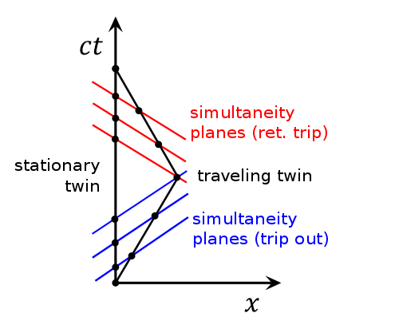

# Minkoww

## Overview

Minkoww is a desktop application designed to visualize Minkowski spacetime diagrams, which are essential for understanding concepts in special relativity. By providing an interactive interface, Minkoww makes it easier to explore and analyze scenarios such as the Twin Paradox, illustrating the effects of time dilation and relative motion on different objects.

## Motivation: Understanding the Twin Paradox
The Twin Paradox is a thought experiment in special relativity that illustrates the phenomenon of time dilation. Here's a brief overview of the paradox:

- Setup: There are twin clones, A and B. A stays on Earth, while B decides to travel to a distant planet in a very fast spaceship.
- Start of the Journey: B boards the spaceship and travels towards the distant planet at a speed close to the speed of light. At the moment of departure, both A and B are the same age.
- Time Dilation Effect: According to special relativity, while B is traveling at a very high speed in the spaceship, time for B slows down. This phenomenon is called time dilation. B's clock ticks more slowly, but B does not notice this difference. B experiences time normally according to his own frame of reference. 
- Arrival and Return: After a certain amount of time, B reaches the destination and then turns around to return to Earth. During the return journey, time for B continues to run more slowly.
- Paradox: From A's perspective on Earth, B's time is dilated, and thus B should age more slowly and be younger upon her return. However, from B's perspective, A is the one moving at a high speed away from and then towards her, so B would expect A to be younger. 

As can be seen from above, the facts perceived by B and A do not match, hence it operates as a paradox.

## How can we resolve it?
  

The spaceship, after traveling to a point close to the speed of light, needs to change direction to return to Earth. This means it needs to accelerate in the opposite direction from its original trajectory. From the moment the spaceship starts accelerating back towards Earth, the reference frame changes dramatically, and Earth's time begins to flow incredibly fast (similar to time travel). As a result, the person who traveled into space ends up younger, which aligns with the observed resolution of the paradox.

## Why Minkoww is Needed
Minkowski spacetime diagrams are crucial tools for visualizing and understanding the effects of special relativity. These diagrams allow students, educators, and researchers to see how time and space coordinates transform under relative motion, making abstract concepts more concrete.
Minkoww provides the following benefits:

- Interactive Learning: Users can add objects with different velocities and see their worldlines on the spacetime diagram, helping to visualize how time dilation and length contraction occur.
- Educational Tool: It serves as an excellent teaching aid for instructors explaining special relativity concepts, such as the Twin Paradox.
- Research Aid: Researchers can use Minkoww to simulate different relativistic scenarios, providing a visual aid to theoretical analysis.

By using Minkoww, one can gain a deeper understanding of the fundamental principles of special relativity, making it an invaluable tool for both learning and teaching.

## Features

- Graphical Representation: Visualize spacetime diagrams with axes representing space (x) and time (ct).
- Interactive Controls: Add, select, and remove objects with specified speeds, and see their worldlines plotted in real-time.
- Customizable Plots: Adjust object speeds and immediately observe changes in their trajectories on the spacetime diagram.
- Intuitive Interface: User-friendly layout with clear labels and input fields for easy interaction.